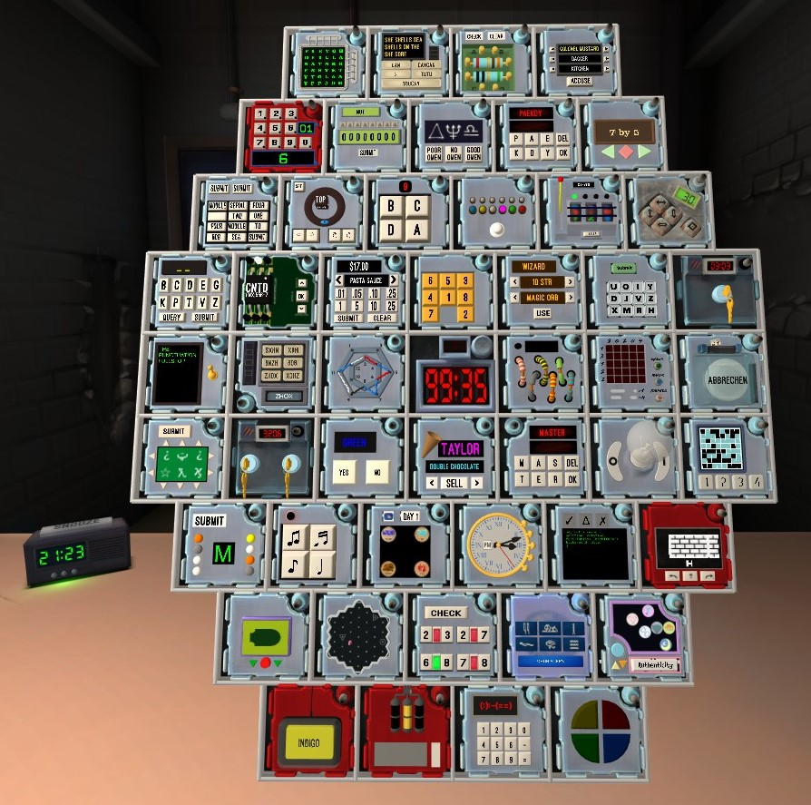
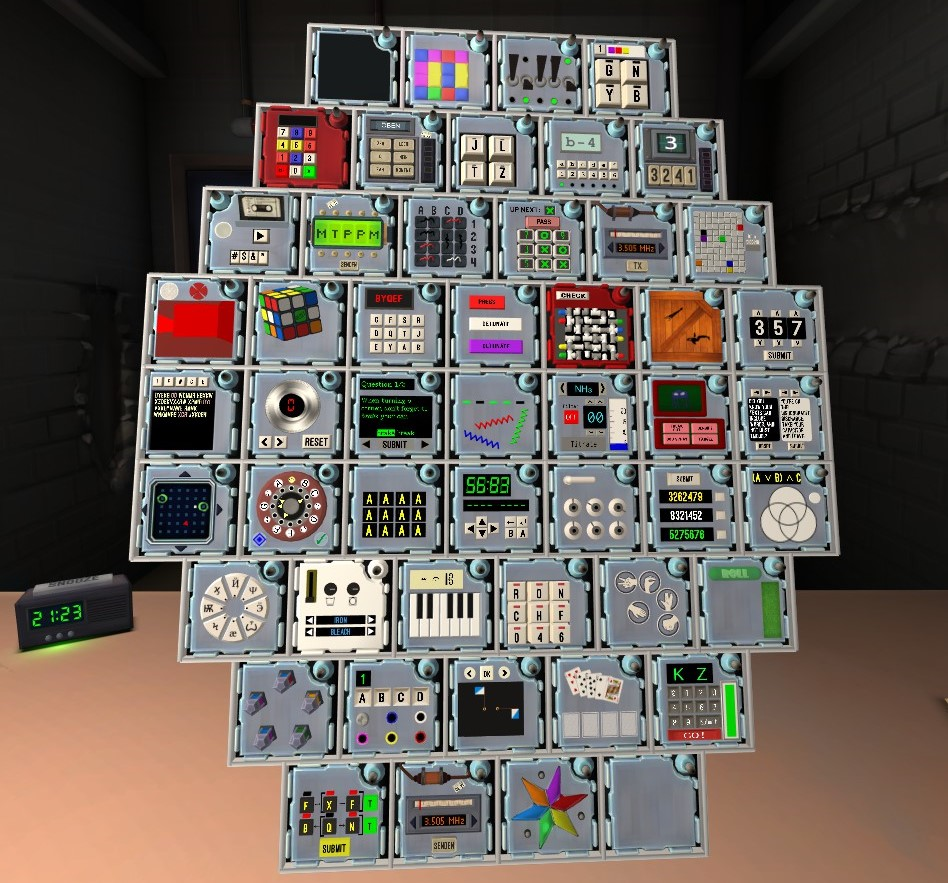
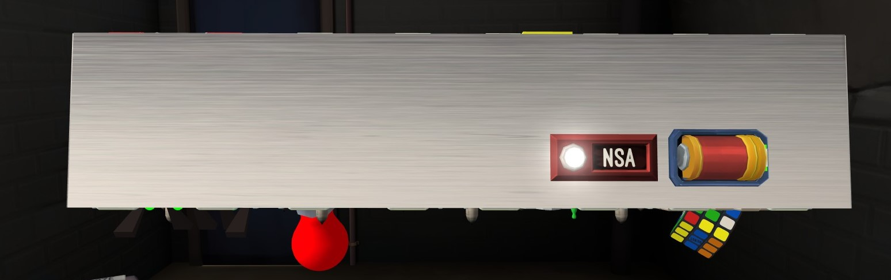
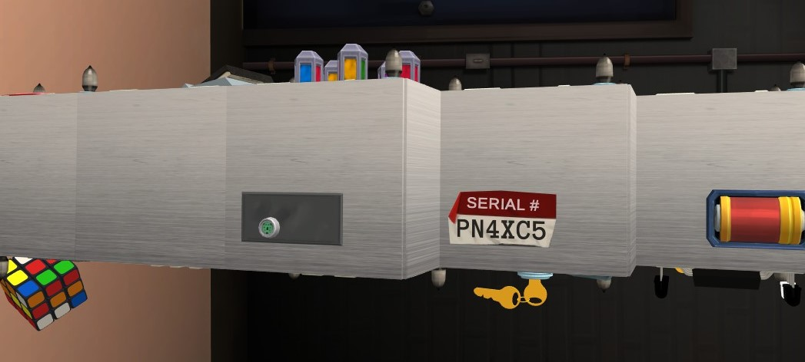

# The Gradle Centurion Bomb Manual
*101 modules, 100 minutes, exponentially more problems.*

## Intro
This project is designed to solve all puzzles found on the Centurion Bomb from Keep Talking and Nobody Explodes, which is a combination of many community-made puzzles and some from the base game set in different languages. See below for pictures or this [parody video](https://www.youtube.com/watch?v=krRPQQz524I). 

This is a **huge** project for one man to tackle, but I've [learned a lot](Learned.md) from the challenges I've faced and this project marks points of my Software Engineering learning journey.

## Technologies
- Java 21
- Gradle 8.5
### Plugins
- JavaFX
- Breadmoirai GitHub Release
### Dependencies
- MaterialFX ver. `11.12.0`
- JFoenix ver. `9.0.4`
- JavaTuple ver. `1.2`
- JGraphT ver. `1.5.2`
- OpenCSV ver. `5.9`
### Other Technologies
- Circle CI with TestNG and Pitest
- CodeMR Free Trial

## Status - In progress
See the running list of modules [here](Progress.md)

## How to run the program
*Disclaimer*: This is referring to program versions `0.22.2` onward
- The `source code` option of the [Release Page](https://github.com/Ultraviolet-Ninja/GradleCenturion/releases) contains an executable, a Windows batch file and all the necessary jar files to run the program
- The `Gradle-Centurion-[VERSION]-[OPERATING SYSTEM]` contains an OS-specific executable file with a runtime environment for the program to run in
  - *Only supports Windows currently*

## Inspiration
After my [first manual](https://github.com/Ultraviolet-Ninja/KTANE_Java_Bomb_Manual) turning out to be successful in solving the main-game bombs, I thought "*Why stop there?*", like Tony Stark, except he was getting his Arc Reactor removed.
I started creating this project working on the auto-solver for the vanilla game, which was, by comparison, much easier. 

### Example Bomb
#### Front view

#### Back view

#### Example Widgets
Widgets are important details about the bomb such that many modules depend on whether particular features are present or
not. The list of details includes Port Types, Number of Port Plates, Lit and Unlit Indicators, Number of Batteries,
Number of Battery Holders, Two-Factor Authentication, and the Serial Code.

**One D Battery** in **one holder** and a **lit NSA indicator**

**One port plate** with a **PS/2 port**, another **D battery in one holder** and a serial code **"PN4XC5"**. 
Overall, this edgework would be given as "1 PS2 port in 1 plate, a lit November SA, 2 in 2 (2 batteries in 2 holders), and serial is Papa November 4 X-ray Charlie 5" (_Using the Nato Phonetic Alphabet_)
